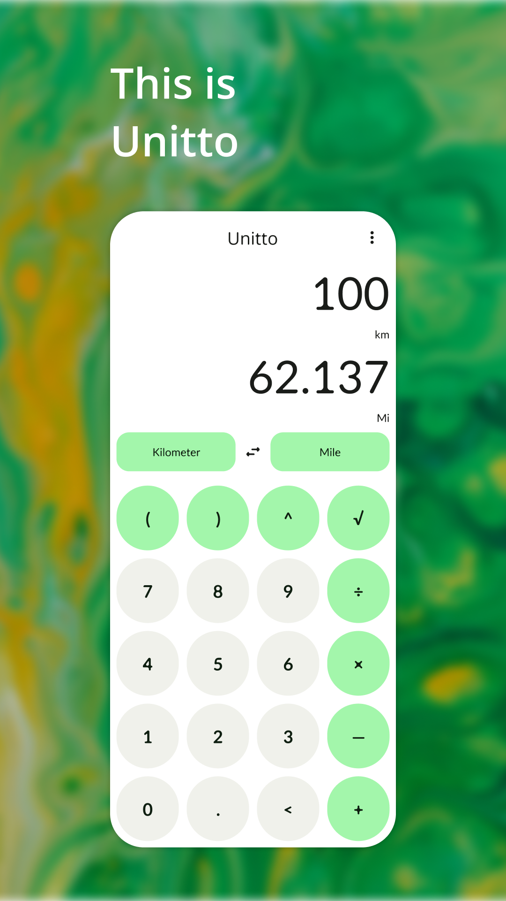
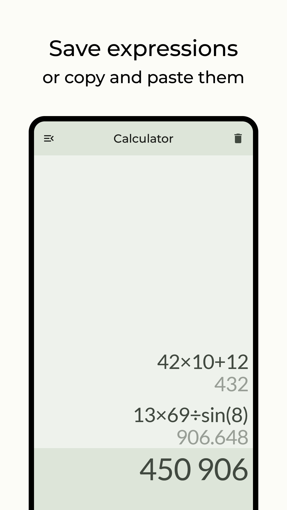
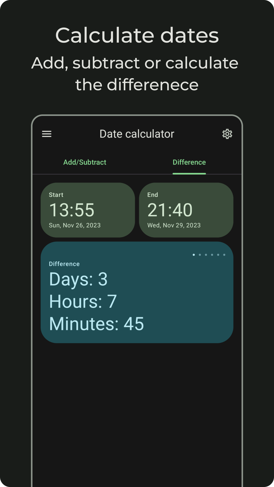
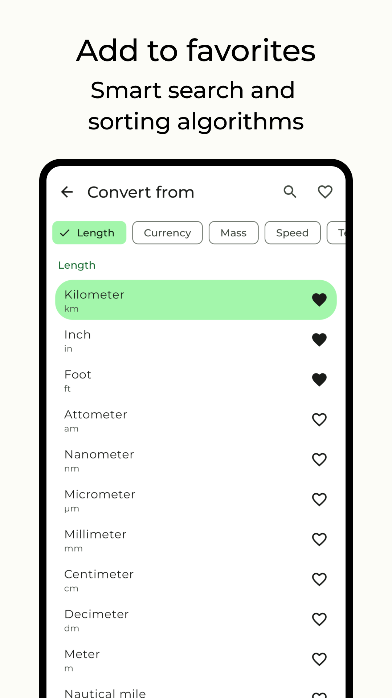
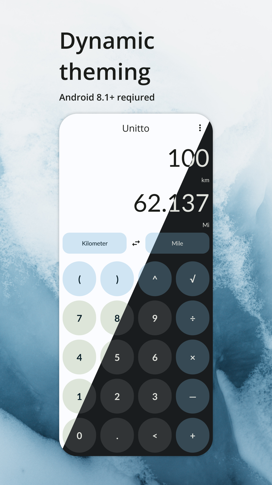

<p align="middle">
    
    
    
    
    
    
</p>

# 📲 Download

<p align="middle">
    <a href="https://play.google.com/store/apps/details?id=com.sadellie.unitto"></a>
    <a href="https://f-droid.org/packages/com.sadellie.unitto"></a>
    <a href="https://github.com/sadellie/unitto/releases/latest"></a>
</p>

Prefer _Google Play_

# 💁‍♀️ Contribute
<p align="middle">
    
</p>

<p align="middle">
    <a href="https://poeditor.com/join/project/T4zjmoq8dx"></a>
    <a href="https://github.com/sadellie/unitto/issues/new"></a>
    <a href="https://github.com/sadellie/unitto/discussions/new/choose"></a>
</p>

## 👩‍💻 Do NOT contribute code
1. I do **NOT** need any help in code.
2. Hard forks and alterations of Unitto are **NOT** welcomed. Use a _Fork_ button so that commits' author is not lost.

# ⚠ Security
Read [this](https://github.com/sadellie/unitto/wiki/Security).

<sup>TL;DR: the app is legit, no cap fr fr</sup>

## 🤖 Custom ROM developers
Leave.

## 🤓 Nerds

<details>
<summary>Benchmarks and Baseline profile</summary>

```
Pixel 8 - 14

StartupBenchmark_startupPrecompiledWithBaselineProfile
timeToInitialDisplayMs   min 183.5,   median 219.9,   max 247.3

StartupBenchmark_startupWithoutPreCompilation
timeToInitialDisplayMs   min 223.6,   median 328.0,   max 663.8

StartupBenchmark_startupWithPartialCompilationAndDisabledBaselineProfile
timeToInitialDisplayMs   min 264.8,   median 308.0,   max 376.1
StartupBenchmark_startupFullyPrecompiled
timeToInitialDisplayMs   min 314.4,   median 336.9,   max 388.3
```
</details>

## 🔎 Additional
Terms and Conditions: https://sadellie.github.io/unitto/terms

Privacy Policy: https://sadellie.github.io/unitto/privacy

FAQ: https://sadellie.github.io/unitto/faq
