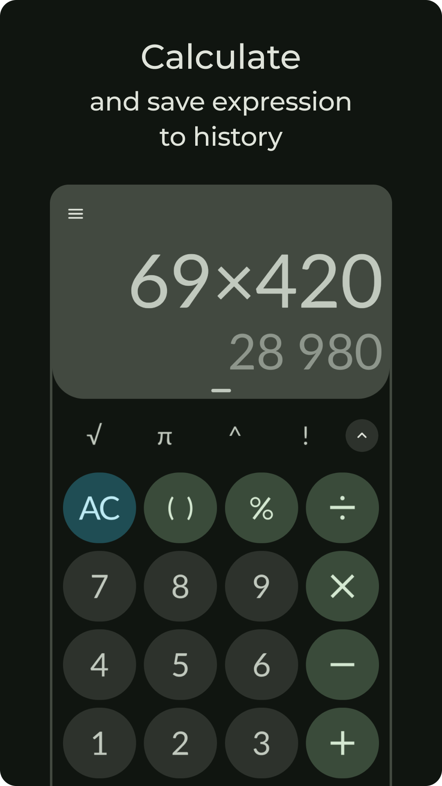

    
    
    
    
    
    

# 📲 Download

    

# 💁‍♀️ Contribute

    

    
    

1. Code contributions are **NOT** accepted at the moment
2. Translations are accepted
3. Hard forks and alterations of Unitto are **NOT** welcomed. Use a _Fork_ button so that commits' author is not lost
4. Do **NOT** use branding materials (app name, icons, descriptions, screenshots and other materials)

# ⚠ Security
Read [this](./SECURITY.md).

TL;DR: the app is legit, no cap fr fr

## 🤖 Custom ROM developers
Leave.

## 🔎 Additional
- Terms and Conditions: https://sadellie.github.io/unitto/terms
- Privacy Policy: https://sadellie.github.io/unitto/privacy
- Help: https://sadellie.github.io/unitto/help
