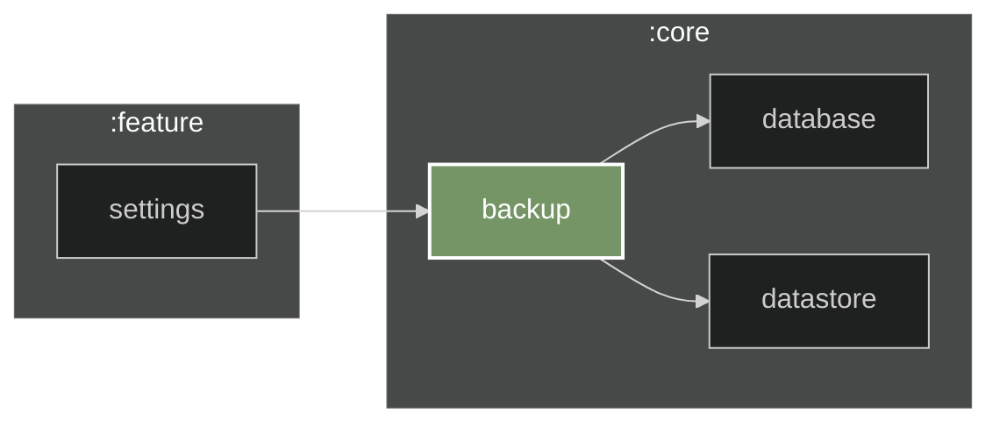

# Backup module

- Saves user data (datastore and database) as archive
- Restores user data from provided archive

## Graph

```mermaid
%%{
  init: {
    'theme': 'dark'
  }
}%%

graph LR
  subgraph :core
    :core:backup["backup"]
    :core:database["database"]
    :core:datastore["datastore"]
  end
  subgraph :feature
    :feature:settings["settings"]
  end
  :feature:settings --> :core:backup
  :core:backup --> :core:database
  :core:backup --> :core:datastore

classDef focus fill:#769566,stroke:#fff,stroke-width:2px,color:#fff;
class :core:backup focus
```