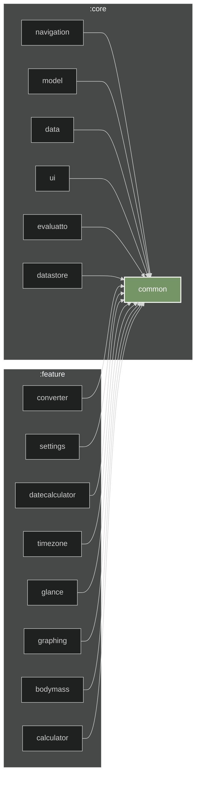

# Common module

Utilities, objects and resources shared between modules. 

## Graph

```mermaid
%%{
  init: {
    'theme': 'dark'
  }
}%%

graph LR
  subgraph :core
    :core:navigation["navigation"]
    :core:common["common"]
    :core:model["model"]
    :core:data["data"]
    :core:ui["ui"]
    :core:evaluatto["evaluatto"]
    :core:datastore["datastore"]
  end
  subgraph :feature
    :feature:converter["converter"]
    :feature:settings["settings"]
    :feature:datecalculator["datecalculator"]
    :feature:timezone["timezone"]
    :feature:glance["glance"]
    :feature:graphing["graphing"]
    :feature:bodymass["bodymass"]
    :feature:calculator["calculator"]
  end
  :core:navigation --> :core:common
  :feature:converter --> :core:common
  :feature:settings --> :core:common
  :core:model --> :core:common
  :feature:datecalculator --> :core:common
  :feature:timezone --> :core:common
  :core:data --> :core:common
  :core:ui --> :core:common
  :feature:glance --> :core:common
  :feature:graphing --> :core:common
  :core:evaluatto --> :core:common
  :core:datastore --> :core:common
  :feature:bodymass --> :core:common
  :feature:calculator --> :core:common

classDef focus fill:#769566,stroke:#fff,stroke-width:2px,color:#fff;
class :core:common focus
```