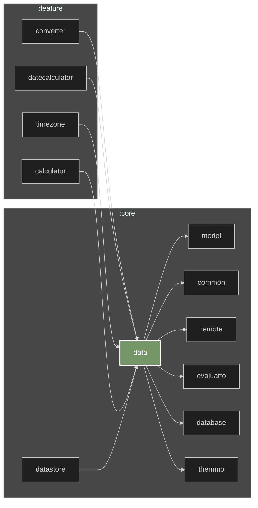

# Data module

Main data provider for feature modules. All repositories are stored in one module for simplicity.

## Graph

```mermaid
%%{
  init: {
    'theme': 'dark'
  }
}%%

graph LR
  subgraph :core
    :core:data["data"]
    :core:model["model"]
    :core:common["common"]
    :core:remote["remote"]
    :core:evaluatto["evaluatto"]
    :core:database["database"]
    :core:themmo["themmo"]
    :core:datastore["datastore"]
  end
  subgraph :feature
    :feature:converter["converter"]
    :feature:datecalculator["datecalculator"]
    :feature:timezone["timezone"]
    :feature:calculator["calculator"]
  end
  :feature:converter --> :core:data
  :feature:datecalculator --> :core:data
  :feature:timezone --> :core:data
  :core:data --> :core:model
  :core:data --> :core:common
  :core:data --> :core:remote
  :core:data --> :core:evaluatto
  :core:data --> :core:database
  :core:data --> :core:themmo
  :core:datastore --> :core:data
  :feature:calculator --> :core:data

classDef focus fill:#769566,stroke:#fff,stroke-width:2px,color:#fff;
class :core:data focus
```