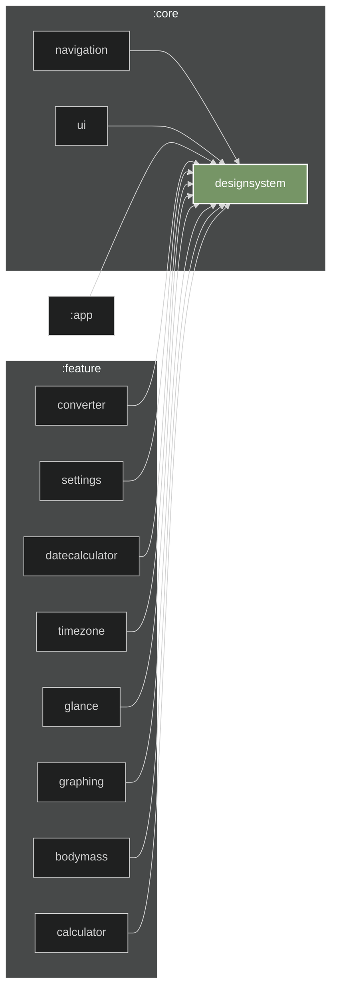

# Design system module

Basic branding resources: color scheme, icons and shapes. All icons are converted using [Valkyrie](https://github.com/ComposeGears/Valkyrie/). Some icons are hand-drawn by me, their source file is not open source.

## Graph

