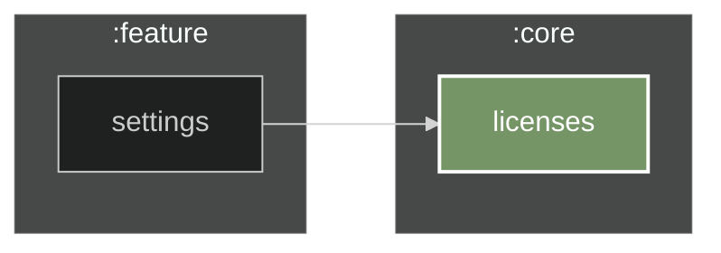

# Licenses module

Resources and libraries used in Unitto. Accessible from Settings. Do not translate!

## Graph

```mermaid
%%{
  init: {
    'theme': 'dark'
  }
}%%

graph LR
  subgraph :core
    :core:licenses["licenses"]
  end
  subgraph :feature
    :feature:settings["settings"]
  end
  :feature:settings --> :core:licenses

classDef focus fill:#769566,stroke:#fff,stroke-width:2px,color:#fff;
class :core:licenses focus
```