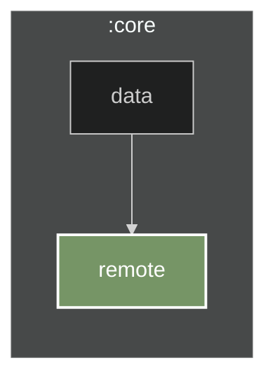

# Remote module

Module to get data from network. Currently used for currencies only.

## Graph

```mermaid
%%{
  init: {
    'theme': 'dark'
  }
}%%

graph LR
  subgraph :core
    :core:data["data"]
    :core:remote["remote"]
  end
  :core:data --> :core:remote

classDef focus fill:#769566,stroke:#fff,stroke-width:2px,color:#fff;
class :core:remote focus
```