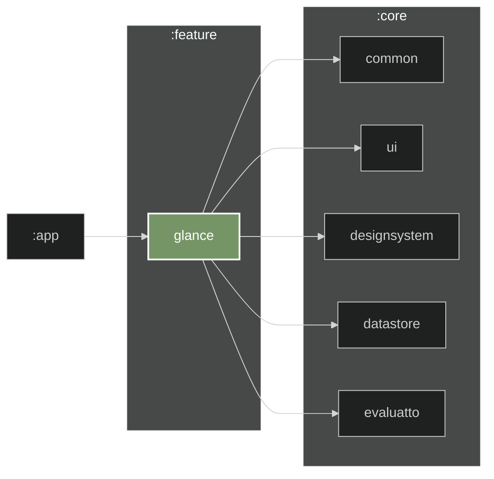

# Glance module

Android home screen widgets. Do NOT merge with other modules. Keep separate for multiplatform.

## Graph

```mermaid
%%{
  init: {
    'theme': 'dark'
  }
}%%

graph LR
  subgraph :core
    :core:common["common"]
    :core:ui["ui"]
    :core:designsystem["designsystem"]
    :core:datastore["datastore"]
    :core:evaluatto["evaluatto"]
  end
  subgraph :feature
    :feature:glance["glance"]
  end
  :app --> :feature:glance
  :feature:glance --> :core:common
  :feature:glance --> :core:ui
  :feature:glance --> :core:designsystem
  :feature:glance --> :core:datastore
  :feature:glance --> :core:evaluatto

classDef focus fill:#769566,stroke:#fff,stroke-width:2px,color:#fff;
class :feature:glance focus
```