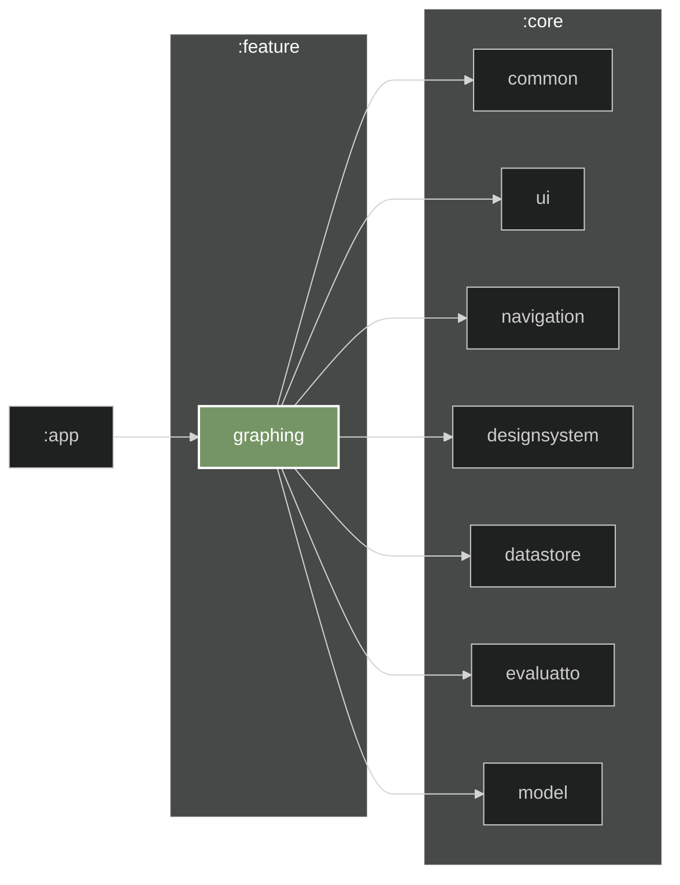

# Graphing module

Experimental! Will be replaced.

## Graph

```mermaid
%%{
  init: {
    'theme': 'dark'
  }
}%%

graph LR
  subgraph :core
    :core:common["common"]
    :core:ui["ui"]
    :core:navigation["navigation"]
    :core:designsystem["designsystem"]
    :core:datastore["datastore"]
    :core:evaluatto["evaluatto"]
    :core:model["model"]
  end
  subgraph :feature
    :feature:graphing["graphing"]
  end
  :app --> :feature:graphing
  :feature:graphing --> :core:common
  :feature:graphing --> :core:ui
  :feature:graphing --> :core:navigation
  :feature:graphing --> :core:designsystem
  :feature:graphing --> :core:datastore
  :feature:graphing --> :core:evaluatto
  :feature:graphing --> :core:model

classDef focus fill:#769566,stroke:#fff,stroke-width:2px,color:#fff;
class :feature:graphing focus
```